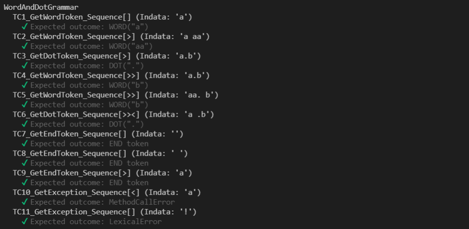
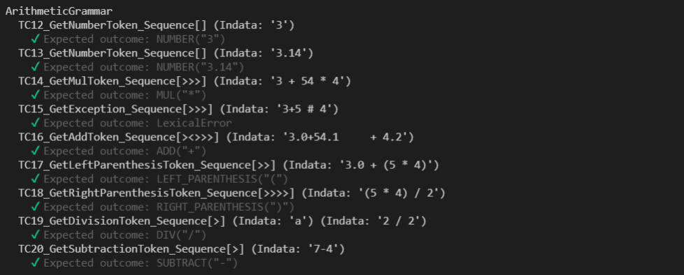
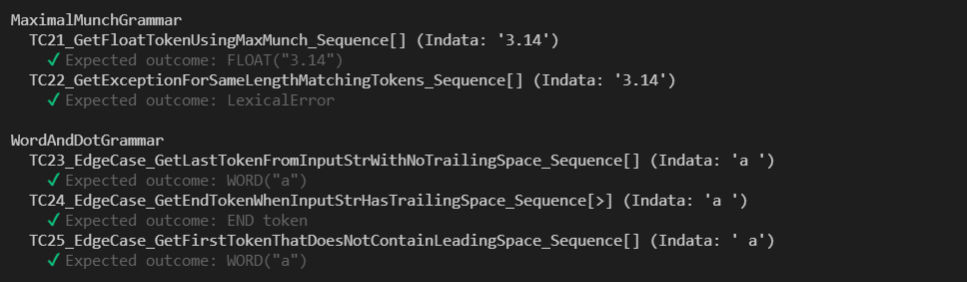
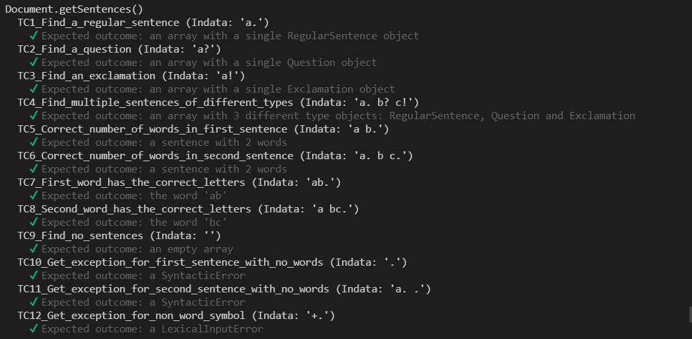
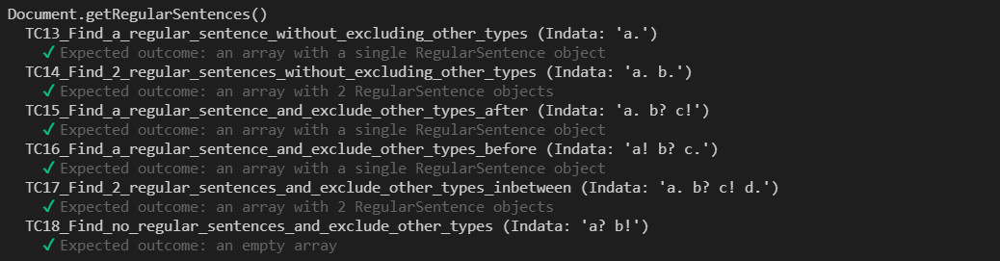
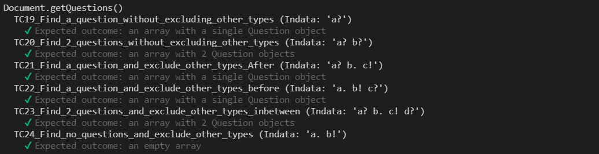
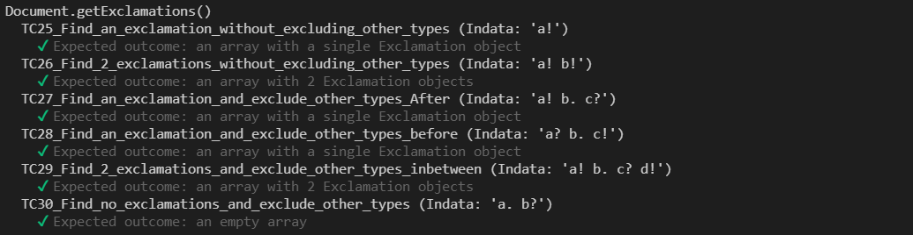
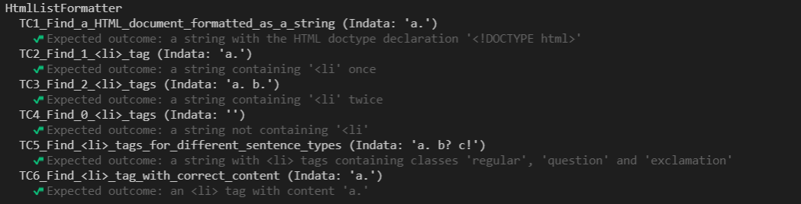

# Template for submission laboratory 2, 1dv610

## Checklist

  - [✅] I have written all the code and reflections myself. I have not used other people's code to solve the task.
  - [✅] My test results are written based on testing performed (and not theoretically, it should work :))
  - [✅] The only static methods or functions outside of classes that I have are to start my test application ex main (java).
  - [✅] The only libraries and ready-made classes used are those that must be used (or used to test the module).

## Self-assessment and goals

  - [ ] I'm not done because I know I'm missing something. Then do not submit!
  - [ ] I strive with this submission approved grade (E-D)
    - [✅] Most test cases work
    - [✅] The code is ready for reuse
    - [✅] All code and history are in git
    - [✅] Reflection is written
    - [✅] The code is readable.
  - [✅] I strive with this submission higher grade (C) and consider that I have fulfilled all extra requirements for this.
    - [✅] I'm careful in my testing
    - [✅] A number of test cases are automated (Tokenizer/Parser/PP), certain parts can be manually tested.
    - [✅] THere is a clear description of how my modules should be used.
    - [✅] My reflections show clearly that I have understood the books concepts.
  - [ ] I strive with this submission highest grade (A-B)
    - [ ] Coherent reflection that gives a good overall impression and shows a detailed understanding of code quality.
    - [ ] My code is ... (kiss fingers and make a smacking sound).
    - [ ] Extra information parser is included as a separate module(s).

Clarification: The examiner will give grades regardless of what you think. To have "things" from higher grade levels is positive and can compensate for shortages in the submission.

## Components and reuse
 * Link URL if you use different repositories for your different components.  
  
[tokeniz3r](https://gitlab.lnu.se/1dv610/student/nt222fc/l1)  
[doc-pars3r](https://gitlab.lnu.se/1dv610/student/nt222fc/l2)  
[pretty-print3r](https://github.com/niall-thurrat/1dv610-l2-pretty-printer)  
  
 * Describe the components and how to use them.  
  
Tokeniz3r is a published npm package and can be installed and imported into any nodejs project using ES6. It had no dependencies and  provies a tokenizer class through it's interface that is used to break strings into tokens based on the user's own grammar rules.  
  
Doc-Pars3r is a non-published npm package that must be cloned from the gitlab repository then linked locally to other npm packages as a dependency. It can then be imported into other nodejs projects locally (ES6 required). It has one dependency: tokeniz3er. It uses the tokens created by tokeniz3r to generate a document with symantic parts; specifically sentences, words and closing punctuation. It offers a Parser class through its interface that generates a parsed document from an input string using its internal grammar rules.  
  
Pretty-print3r is a non-published npm package that must be cloned from the github repository. It must be linked locally to doc-pars3r before it can be run. It is executed with a start script that requires a single string argument of one or more sentences that it then uses to update a output.html document containing a formatted list of sentences. This output doc is found in the IO folder.  
  
 * Describe how you adapted your code and instructions for another programmer to be able to use your components. If you have written instructions for your user link to them. If not describe here how someone should do this.  
  
First and foremost I have tried to use intention revealing names for classes and methods that are accessible through each module's public interface.  
  
I have also provided detailed information in each module's README.md file:  
[tokeniz3r README.md](https://gitlab.lnu.se/1dv610/student/nt222fc/l1/-/blob/master/README.md)  
[doc-pars3r README.md](https://gitlab.lnu.se/1dv610/student/nt222fc/l2/-/blob/master/README.md)  
[pretty-print3r README.md](https://github.com/niall-thurrat/1dv610-l2-pretty-printer/blob/main/README.md)  
  
 * Describe how you ensured that the dependencies between the components are as described in the laboratory.  
  
The tokenizer was developed first and was completely stand alone with no other npm packages as dependencies. It's interface means it can be fed user specific grammar rules and an input string to be tokenized based on those rules.  Tokeniz3r was changed in no way to suit the functionality of doc-pars3r.
  
The parser was developed next and imported the tokeniser module, thus creating the expected dependency. There are no other dependencies. The parser has a set of baked in rules that are coded based on the functionality of the tokenizer. These are internally used to create a tokeniz3r instance that provides tokens to the parser. Doc-pars3r was not adapted in any way to suit the functionality of the pretty printer.
  
The pretty printer was developed last. Doc-pars3r is a dependency because it is used to break an input string into symmantic parts that can then be listed in an output.html file.  
  
## Description of my code

**Describe your code at a high level of abstraction. A brief description of your most important classes and methods in your components. Feel free to create a class diagram as a picture. Describe the relationships between the classes between components.**

Tokeniz3r is a stand-alone module that functions independently of any dependencies. It exposes a single class, the Tokenizer class, which has been built with simplicity in mind. It's public methods constitute the module's public interface: getActiveToken, setActiveTokenToNext and setActiveTokenToPrevious. When the class is instantiated it takes two arguments: an input string and a set of grammar rules bases on regex matching.

Doc-pars3r has been built with only one dependency. It imports the Tokeniz3r module and creates an instance of the Tokenizer class in it's Parser class which is exposed through it's public interface. The classes one public method, parseDocument, takes a single string argument and uses this along with its internally hard-coded grammar rules object to generate the tokenizer instance, then creates and returns an instance of the Document class (a parsed document) using the tokenizer instance as an argument.

Pretty-print3r uses doc-pars3r as a dependency. In app.js it imports doc-pars3r and creates an instance of it's Parser class passing a string argument that it gets from the app start script. It then passes the returned parsed doc to it's HtmlListFormatter class which generates html that is then passed to the Printer class to be written to the output.html file.

## How I tested

**Describe how you came to the conclusion that your code works. Describe the different parts and how they were tested. Screenshots from manual testing.**

All 3 modules have a mocha test suite (using the chai expect assertion library) with only passing tests. Instructions for running the tests are found in each README.md. I believe the tests cover the functional requirements of each module including testing that exceptions are thrown as required and testing tries to include edge cases where appropriate.

The Tokeniz3r tests are separated into 4 categories: the first 3 categories test 3 different grammar types and the last focuses on edge cases.

The Doc-pars3r tests are separated into 4 categories. Each tests the results returned from one of the four public methods of the Document class: getSentences, getRegularSentences, getQuestions and getExclamations.

The Pretty-print3r mocha test suit has one category of tests for the HtmlListFormatter class. I have added 2 manual test cases which check that the Printer class functions as expected.

## Test cases

List the individual test cases, or link to this.

**Tokeniz3r Automatic testing**

**Doc-Pars3r Automatic testing**

**Pretty-Print3r Automatic testing**

**Pretty-Print3r Manual testing**

| Name | Prerequisite | Indata | Expected Outcome | PASS / FAIL |
| ---- | ------------ | ------ | ---------------- | ----------- |
| TC7_Find_html_code_written_to_empty_IO/output.html | output.html file has no content | 'one. two? three!' | html formatted doc with list of 3 items| PASS |
| TC8_Find_html_code_has_overwritten_IO/output.html | output.html file has content 'overwrite me!' | 'one. two? three!' | html formatted doc with list of 3 items| PASS |

## Chapter Reflections for Chapters 2-11
Go through all code including code from laboratory 1 and update according to the book's clean code chapters 2-11 and what we discussed at lectures and workshops. Write a short (4-6 sentences) reflection for each chapter on how that particular chapter has affected or not affected your code. Use the book's terms. Give examples with readable screenshots from your code for each reflection.

Focus on clarity, variety, honesty and what's interesting. For example, if you have unclear considerations with different quality rules that are in conflict with each other, these are extra interesting.

### Code quality requirements for higher grades
Same as for lower grades, but bake the 10 reflections from the different chapters into a coherent text that spans both tasks. You thus have a single reflection fixed for both the code in task 1 and task 2. About two pages max. Use varied expressions from the book.

NA

## Laboratory reflection
Reflect on the task based on your development as a programmer.
What have you learned and what do you look forward to learning?
