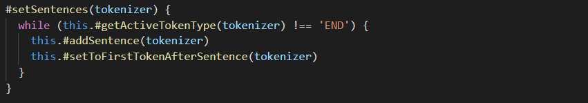
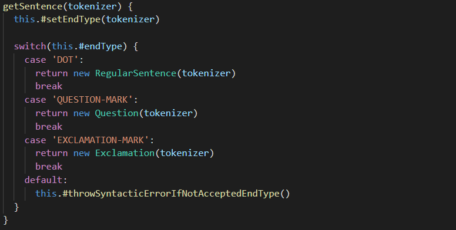
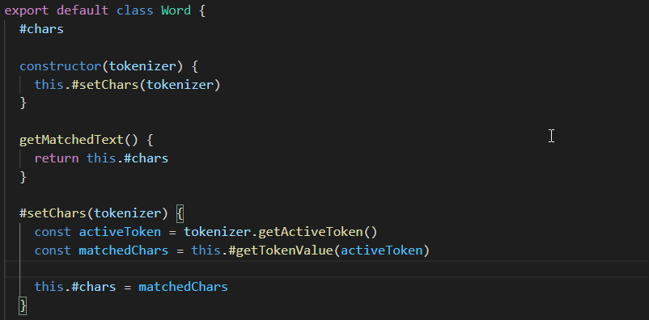
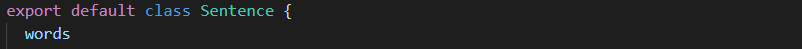
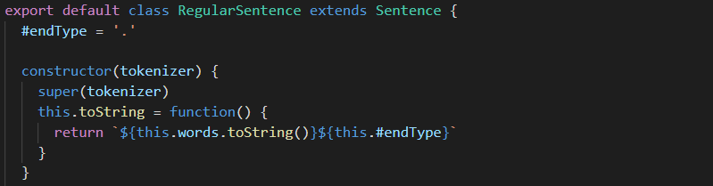
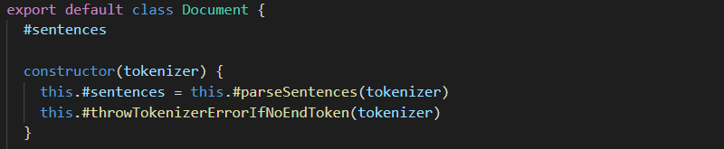

# Template for submission laboratory 2, 1dv610

## Checklist

  - [✅] I have written all the code and reflections myself. I have not used other people's code to solve the task.
  - [✅] My test results are written based on testing performed (and not theoretically, it should work :))
  - [✅] The only static methods or functions outside of classes that I have are to start my test application ex main (java).
  - [✅] The only libraries and ready-made classes used are those that must be used (or used to test the module).

## Self-assessment and goals

  - [ ] I'm not done because I know I'm missing something. Then do not submit!
  - [ ] I strive with this submission approved grade (E-D)
    - [✅] Most test cases work
    - [✅] The code is ready for reuse
    - [✅] All code and history are in git
    - [✅] Reflection is written
    - [✅] The code is readable.
  - [✅] I strive with this submission higher grade (C) and consider that I have fulfilled all extra requirements for this.
    - [✅] I'm careful in my testing
    - [✅] A number of test cases are automated (Tokenizer/Parser/PP), certain parts can be manually tested.
    - [✅] THere is a clear description of how my modules should be used.
    - [✅] My reflections show clearly that I have understood the books concepts.
  - [ ] I strive with this submission highest grade (A-B)
    - [ ] Coherent reflection that gives a good overall impression and shows a detailed understanding of code quality.
    - [ ] My code is ... (kiss fingers and make a smacking sound).
    - [ ] Extra information parser is included as a separate module(s).

Clarification: The examiner will give grades regardless of what you think. To have "things" from higher grade levels is positive and can compensate for shortages in the submission.

## Components and reuse
 * Link URL if you use different repositories for your different components.  
  
[tokeniz3r](https://gitlab.lnu.se/1dv610/student/nt222fc/l1)  
[doc-pars3r](https://gitlab.lnu.se/1dv610/student/nt222fc/l2)  
[pretty-print3r](https://github.com/niall-thurrat/1dv610-l2-pretty-printer)  
  
 * Describe the components and how to use them.  
  
Tokeniz3r is a published npm package and can be installed and imported into any nodejs project using ES6. It had no dependencies and  provies a tokenizer class through it's interface that is used to break strings into tokens based on the user's own grammar rules.  
  
Doc-Pars3r is a non-published npm package that must be cloned from the gitlab repository then linked locally to other npm packages as a dependency. It can then be imported into other nodejs projects locally (ES6 required). It has one dependency: tokeniz3er. It uses the tokens created by tokeniz3r to generate a document with symantic parts; specifically sentences, words and closing punctuation. It offers a Parser class through its interface that generates a parsed document from an input string using its internal grammar rules.  
  
Pretty-print3r is a non-published npm package that must be cloned from the github repository. It must be linked locally to doc-pars3r before it can be run. It is executed with a start script that requires a single string argument of one or more sentences that it then uses to update a output.html document containing a formatted list of sentences. This output doc is found in the IO folder.  
  
 * Describe how you adapted your code and instructions for another programmer to be able to use your components. If you have written instructions for your user link to them. If not describe here how someone should do this.  
  
First and foremost I have tried to use intention revealing names for classes and methods that are accessible through each module's public interface.  
  
I have also provided detailed information in each module's README.md file:  
[tokeniz3r README.md](https://gitlab.lnu.se/1dv610/student/nt222fc/l1/-/blob/master/README.md)  
[doc-pars3r README.md](https://gitlab.lnu.se/1dv610/student/nt222fc/l2/-/blob/master/README.md)  
[pretty-print3r README.md](https://github.com/niall-thurrat/1dv610-l2-pretty-printer/blob/main/README.md)  
  
 * Describe how you ensured that the dependencies between the components are as described in the laboratory.  
  
The tokenizer was developed first and was completely stand alone with no other npm packages as dependencies. It's interface means it can be fed user specific grammar rules and an input string to be tokenized based on those rules.  Tokeniz3r was changed in no way to suit the functionality of doc-pars3r.
  
The parser was developed next and imported the tokeniser module, thus creating the expected dependency. There are no other dependencies. The parser has a set of baked in rules that are coded based on the functionality of the tokenizer. These are internally used to create a tokeniz3r instance that provides tokens to the parser. Doc-pars3r was not adapted in any way to suit the functionality of the pretty printer.
  
The pretty printer was developed last. Doc-pars3r is a dependency because it is used to break an input string into symmantic parts that can then be listed in an output.html file.  
  
## Description of my code

**Describe your code at a high level of abstraction. A brief description of your most important classes and methods in your components. Feel free to create a class diagram as a picture. Describe the relationships between the classes between components.**

Tokeniz3r is a stand-alone module that functions independently of any dependencies. It exposes a single class, the Tokenizer class, which has been built with simplicity in mind. It's public methods constitute the module's public interface: getActiveToken, setActiveTokenToNext and setActiveTokenToPrevious. When the class is instantiated it takes two arguments: an input string and a set of grammar rules bases on regex matching.

Doc-pars3r has been built with only one dependency. It imports the Tokeniz3r module and creates an instance of the Tokenizer class in it's Parser class which is exposed through it's public interface. The classes one public method, parseDocument, takes a single string argument and uses this along with its internally hard-coded grammar rules object to generate the tokenizer instance, then creates and returns an instance of the Document class (a parsed document) using the tokenizer instance as an argument.

Pretty-print3r uses doc-pars3r as a dependency. In app.js it imports doc-pars3r and creates an instance of it's Parser class passing a string argument that it gets from the app start script. It then passes the returned parsed doc to it's HtmlListFormatter class which generates html that is then passed to the Printer class to be written to the output.html file.

## How I tested

**Describe how you came to the conclusion that your code works. Describe the different parts and how they were tested. Screenshots from manual testing.**

All 3 modules have a mocha test suite (using the chai expect assertion library) with only passing tests. Instructions for running the tests are found in each README.md. I believe the tests cover the functional requirements of each module including testing that exceptions are thrown as required and testing tries to include edge cases where appropriate.

The Tokeniz3r tests are separated into 4 categories: the first 3 categories test 3 different grammar types and the last focuses on edge cases.

The Doc-pars3r tests are separated into 4 categories. Each tests the results returned from one of the four public methods of the Document class: getSentences, getRegularSentences, getQuestions and getExclamations.

The Pretty-print3r mocha test suit has one category of tests for the HtmlListFormatter class. I have added 2 manual test cases which check that the Printer class functions as expected.

## Test cases

List the individual test cases, or link to this.

**Tokeniz3r Automatic testing**

**Doc-Pars3r Automatic testing**

**Pretty-Print3r Automatic testing**

**Pretty-Print3r Manual testing**

| Name | Prerequisite | Indata | Expected Outcome | PASS / FAIL |
| ---- | ------------ | ------ | ---------------- | ----------- |
| TC7_Find_html_code_written_to_empty_IO/output.html | output.html file has no content | 'one. two? three!' | html formatted doc with list of 3 items| PASS |
| TC8_Find_html_code_has_overwritten_IO/output.html | output.html file has content 'overwrite me!' | 'one. two? three!' | html formatted doc with list of 3 items| PASS |

## Chapter Reflections for Chapters 2-11
Go through all code including code from laboratory 1 and update according to the book's clean code chapters 2-11 and what we discussed at lectures and workshops. Write a short (4-6 sentences) reflection for each chapter on how that particular chapter has affected or not affected your code. Use the book's terms. Give examples with readable screenshots from your code for each reflection.

Focus on clarity, variety, honesty and what's interesting. For example, if you have unclear considerations with different quality rules that are in conflict with each other, these are extra interesting.

**Meaningful Names** - In general, I have adapted how I name things considerably while trying to apply the concepts of this chapter. Most significantly, I would say that my names have in general become longer in an effort to increase the understandability of my code and I have found myself favour understandability over readability. Martin strongly stresses [1, p.18] how important intention-revealing names are, so I have paid particular attention to this advice, e.g., one of the longest method names I have is *setToFirstTokenAfterSentence(tokenizer)* in the *Sentences* class in *Doc-Pars3r* (Fig. 1). This could have been shortened to *setToNextSentence* but would not have been accurate and would not have described as clearly what the function is actually doing.
  
  
Fig. 1: The *setSentences* method of the *Sentence* class in *Doc-Pars3r*  

Before reading [1] I definitely would have shortened this but I now appreciate the value of clarity and have no problem using this name for a private method that is scarcely used. I would however consider reducing this for readability if the method was used much more.

Another decision I made to improve understandability (at the expense of readability) was to avoid using single letter variable names. In Fig. 1 the tokenizer argument had previously been named 't' but was changed to reduce any need for mental mapping.

**Functions** - Perhaps the most significant effect that Martin’s Functions chapter [1, p.31] has had on my code is that I now write smaller functions but write much more of them. The narrative that can be achieved by doing this while using descriptive function names is very powerful. Only a small number of methods in all 3 modules are larger than the four lines of code that are recommended as a limit by Martin [1. p.34]. This has also made it easier for me to follow Martin's 'Do One Thing' rule [1, p. 35]. A good example of this in my code is seen above in Fig. 1. This method contains a while loop with two method calls that cleanly describe on a higher abstraction level how the function achieves its single purpose, yet they hide the lower-level code that would make this method large and hard to understand.

One notable exception in *Doc-pars3r* to Martin's 'Small!' rule is my *getSentence* method in the *SentenceFactory* class shown below in Fig. 2.

  
Fig. 2: The *getSentence* method of the *SentenceFactory* class in *Doc-pars3r*

I have favoured using a switch statement here over a series of 'if else' statements (which could have made the function half the size) for the sake of readability. I follow Martin's advice to use the switch statement in a factory class [1, p.37].

**Comments** -Admittedly I’ve thrown a lot of Martin's recommendations about comments [1, p.53] out the window while coding my 3 modules. During coding I chose to write a lot of comments to myself that would confuse the hell out of other programmers working on the project for the sake of quicker development. I am fully aware it is not good practice but consider the comments acceptable as I am the only developer working on the app and am quite sure nobody else will develop it in futue. I have, however, tried to adhere to Marin’s advice with the comments that have remained in my submitted code, i.e. I’ve basically not used them with the exception of two TODO comments for unfinished code in Pretty-print3r and two comments in *Tokeniz3r* that explain some hard-to-understand regular expressions.

**Formatting** - Recommendations in this chapter [1. p75] have made me carefully consider, most significantly, how I vertically format my code. Rules such as structuring code like a newspaper with broader concepts first, keeping concepts together and placing methods immediately after the method in which they are called make a lot of sense, but I have found these rules often clash and that it is hard to stay consistent. For example, in my *Word* class as shown in Fig. 3 below, I would like to have the *setChars* method directly after the constructor where it is called, but I also want to be consistent with all other classes that put the public methods first because I consider these more important and broader concepts.

  
Fig. 3: The *Word* class in *Doc-pars3r*

I experienced another problem with vertical distance in my abstract class *Sentence* and its sub-classes because I have one property in the abstract class (Fig.4) and one in the sub-class (Fig.5). I have been unable to find a way to put both in the parent class. It seems very strange to refer to the parent class property *words* in the constructor of the sub-classes, as shown in Fig.5. I also had to make this property public to be accessible in the sub-classes and couldn't find a way to solve this serious issue.

  
Fig. 4: The *Sentence* class *words* property in *Doc-pars3r*

  
Fig. 5: The *RegularSentence* class *endType* property and constructor in *Doc-pars3r*

It is also worth pointing out that I made a conscious decision early in the assignment not to use 'Team Rules' by removing the *lnu eslint* npm package. The linter contradicts a number of rules in the book that I wanted to follow, e.g. it demands comments on every function and class. I opted to largely stick to JS standard style instead.

**Objects and Data Structures** – This chapter has made me seriously reconsider the purpose of classes that I write and has made me focus on hiding their implementation. This has been tough though because I often feel like I'm simply creating getters and setters on class properties but changing the names to try to create some form of abstraction. For my Document class in Doc-pars3r I couldn’t even do that, as I felt that using any names other than *sentences* and *getSentences* for the property and getter respectively would have been making things unnecessarily complicated or less appropriately named. This happens in a number of other classes, such as *Tokenizer* which has an *activeToken* property and a *getActiveToken* public method.

Trying to adhere to the *law of Demeter* has also had a big effect on how I code. This led to some refactors to remove chaining methods from multiple objects. For example, I had to replace my *Tokenizer.getActiveToken.getType()* calls with code that passed the *activeToken* object as an argument to another private method.

**Error Handling** - There are a number of thrown exceptions (in *Doc-pars3r* and *Pr3tty-print3r*) that have not been included in testing due to time constraints and the necessity to mock objects (something I need to learn). As a result, I am unsure as to whether or not these are actually reachable for testing or even if they are of use in the code base. For example, in *Doc-pars3r's* *Document* class I have a *throwTokenizerErrorIfNoEndToken* method in the constructor (Fig. 6), but I think this may never get called as the error should be picked up elsewhere in the module before it gets to this point.

  
Fig. 6: The *Document* class *sentences* property and constructor in *Doc-pars3r*

**Boundaries** - The 'learning tests' that Martin discusses [1, p.116] are largely unnecessary in the instance of my three modules as the dependencies have been written by me (with the one exception of the fs-extra module used in Pretty-print3r). However, due to time constraints I have not been able to appropriately handle many exceptions that are thrown by dependencies, nor test them, and this could make it difficult to know exactly where the errors are coming from in future.

**Unit Tests** - I have structured my tests vertically in each module's test suite using the *build-operate-check* pattern, one of the patterns viewed favourably by Martin [1, p.127].  I have, however, decided to use multiple *expects* in a lot of tests, something Martin seems to discourage [1, p.131]. This has been for 2 main reasons: in certain tests I need to use multiple expects to test one concept; in other tests I test 2 concepts, e.g. that an array contains certain types and that it is a certain length, but I’ve found that writing two tests in these instances has resulted in one test being redundant or that I break the DRY principle.

**Classes** - Having (concrete) sub-classes (*RegularSentence, Question and Exclamation*) that inherit from a (abstract) parent class (*Sentence*) has caused me some difficulty using JavaScript. Given the lack of a *protected* property type, I have been forced to have a public property (*words*) on the parent class so that it can be used by the inheriting classes.

**Systems** - This chapter has encouraged me to keep system parts simple, i.e. "use the simplest thing that can possibly work [1, p.169]". With this in mind I've tried to have public interfaces that have a few well named public methods to operate them. This has not always been easy due to the tree like structure of objects that is created by *Doc-pars3r* in particular.

### Code quality requirements for higher grades
Same as for lower grades, but bake the 10 reflections from the different chapters into a coherent text that spans both tasks. You thus have a single reflection fixed for both the code in task 1 and task 2. About two pages max. Use varied expressions from the book.

N/A

## Laboratory reflection
Reflect on the task based on your development as a programmer.
What have you learned and what do you look forward to learning?

I think I have learnt a lot about how code can be structured to be easier understood and added to by other developers. This in turn makes me confident that I’m producing is much better quality of code than I did before the course. I have learnt to place much more importance on understandability, at the expense of readability, and now consider a lot of code I have previously written as very dirty due to the sheer amount of need for mental mapping created in an effort to have less code. I am less afraid of larger names, wider lines, and accept that sometimes one needs to write more lines to have better code. Perhaps the biggest take away is the concept of using more fine-grained functions with good naming to create a narrative in my code which in turn removes the need to a large degree for comments. 

Other concepts, such as writing higher abstract code first in classes and following the law of Demeter, still need worked with to sink further into my coding practice in future, and I look forward to trying to implement such concepts and learning more about them to continue to write better quality code.

I have also really enjoyed developing with a test suite to check if I have broken anything as I change the code base. I want to learn more in future about mocking and how to implement this in test suites. TDD still feels like something I must get further practice with to see if it is something that I could incorporate into my coding routines.

Given the very few hours that I have had to work on this project during very irregular study hours, I believe I have gained a heightened appreciation for working with cleaner code, as this has made it much easier for me to pick up where I left off after relatively long periods where I haven’t been able work with the code.

## Reference List
[1] &emsp; R. C. Martin, Clean Code. Boston, MA: Pearson Education, Inc., 2009.
